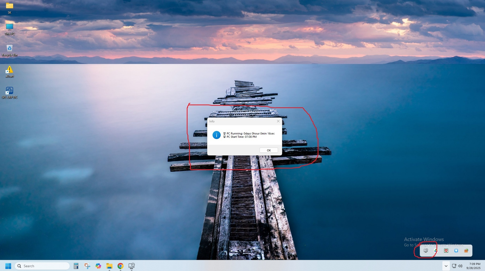

# 🖥️ PC Running Time

**PC Running Time** is a lightweight Windows utility that tracks how long your PC has been running and detects idle time. It runs silently in the system tray and auto-starts with Windows. You’ll receive hourly friendly reminders to take breaks for a healthier workflow.

---

## ✨ Features

- ⏱ **Uptime Tracking** – See how long your PC has been active since startup.
- 💤 **Idle Time Detection** – Tracks how long you've been away from the computer.
- 🔔 **Hourly Reminders** – Get friendly reminders every hour to take a break.
- ⚙️ **Auto Start** – Automatically launches with Windows.
- 🖱️ **Tray Icon Interface** – Control everything from the system tray.

---

## 🚀 How It Works

Once the app starts:
- It minimizes to the system tray.
- Hover over the tray icon to see real-time PC running time.
- Double-click the icon to get a detailed popup showing running time and idle status.
- Right-click for a context menu with options like "About", "Show Running Time", and "Exit".

---

## 🛠️ Installation

1. Clone or download the repository.
2. Build the solution using Visual Studio.
3. Make sure you have an icon file named `app_icon.ico` in the startup path (optional).
4. Run the executable. The app will auto-add itself to Windows startup.

---

---

## 👨‍💻 Developer

**Al Shimbil Khan**  
📧 Email: shimbilmax@gmail.com  
📞 Phone: +88 01516711976

